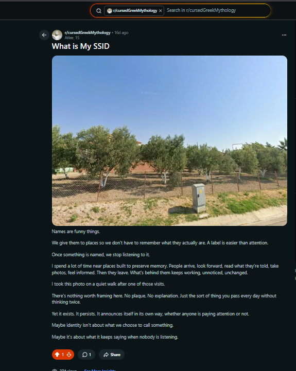
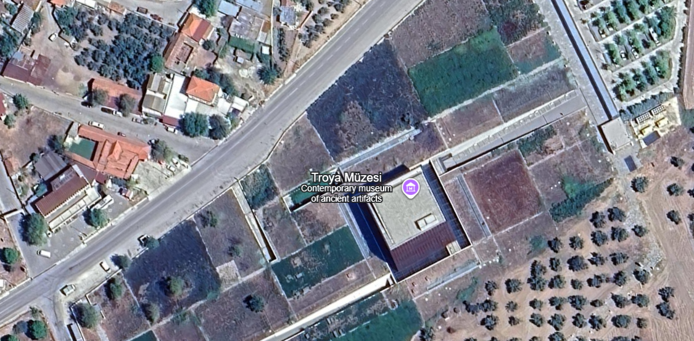
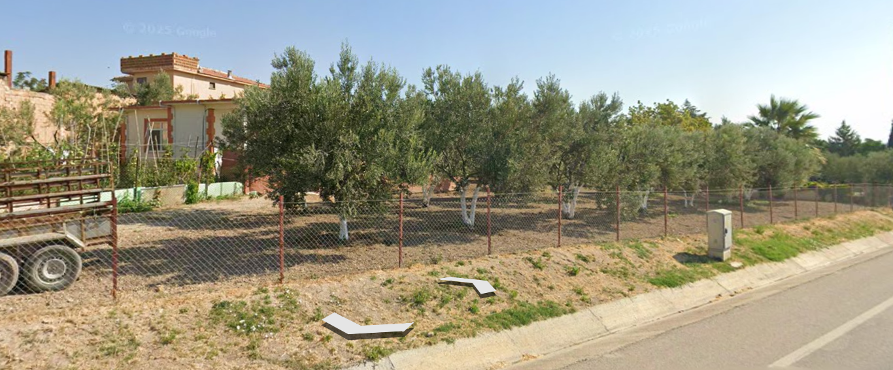
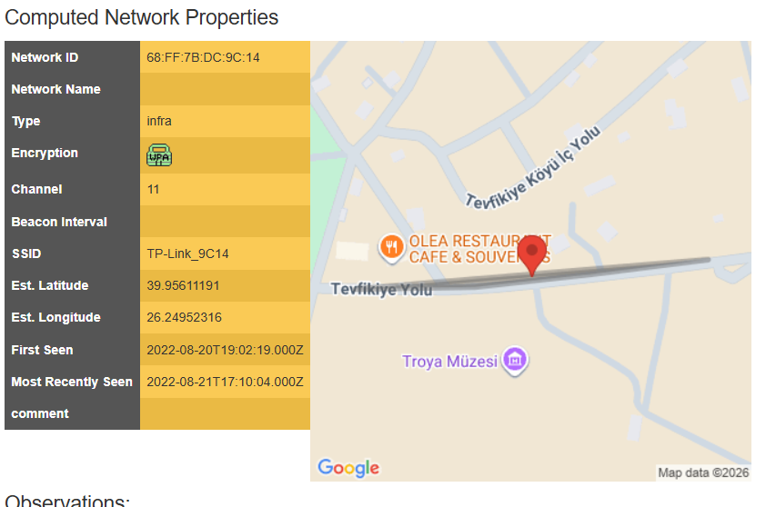

# What Still Speaks  Solution (OSINT)

## Step 1 : Interpret the description correctly
Challenge text:
> Not every identity is announced.  
> Some are inferred through traces, patterns, and influence.  
>  
> No titles. No noise.  
> Only what repeats.

This indicates:
- The target will NOT be given directly (no name/ID)
- The correct approach is association-based OSINT
- The platform is likely professional → LinkedIn

So instead of searching random names, we look for repeated patterns inside the organizing team network.

---

## Step 2 : Find the correct organizer profile (Likith)
Start from any public organizing team footprint:
- event poster credits
- Instagram / LinkedIn organizer posts
-  core team list
- “tagged people” section of event announcements

Now apply the key hint: **"Only what repeats."**
Look for the organizer who appears repeatedly across:
- announcements
- tags
- reposts
- comments
- volunteer/core team mentions

This repetition trail leads to **Likith**.

Result: Likith’s LinkedIn profile is identified.

---

## Step 3 : Move to Likith’s LinkedIn bio
Open Likith’s LinkedIn profile and check:
- **About / Bio**

In the bio we find:

>Observer of systems, not just technology.

>I’m interested in how information survives noise—how truth fragments, moves, and sometimes waits quietly while monuments get the attention. History often speaks from the opposite side of what we choose to look at.

>I believe patterns matter more than statements. Context more than confidence.

>Notes to self (old bookmarks, don’t mind them):
aHR0cHM6Ly93d3cucmVkZGl0LmNvbS9yL2N1cnNlZEdyZWVrTXl0aG9sb2d5

>Some things arrive later: dc9c14

>If you’re searching loudly, you’re already late.
-Atlee_15

This is not normal text → looks like **Base64** encoding.

---

## Step 4 : Decode the Base64 string
Decode:
`aHR0cHM6Ly93d3cucmVkZGl0LmNvbS9yL2N1cnNlZEdyZWVrTXl0aG9sb2d5Lw==`

Decoded output:
`https://www.reddit.com/r/cursedGreekMythology/`

This confirms the bio contains the intended breadcrumb for the next stage.

---

## Step 5 : Pivot to Reddit using the decoded link
The Base64 string decodes to:

`https://www.reddit.com/r/cursedGreekMythology/`

This is a pivot destination, not the flag itself.

The bio also ends with a signature:

`-Atlee_15`

This indicates the handle/username to search for on Reddit.

---

## Step 6 : Search the subreddit for the username
Open `r/cursedGreekMythology` and search for the handle from the bio:

`author:Atlee_15`

This reveals the intended post made by `u/Atlee_15`. Open it to continue.

---
## Step 7 : Extract the SSID clue from the comments
The Reddit post title asks:

**“What is My SSID”**

This indicates the next objective is not just the image, but also the **discussion under it**.

In the comments, we find the suspicious hint:

> idk why, but this gave me that weird feeling — like things start with h, ff and end with { for no clear reason. probably nothing.

This is a strong indicator that the SSID/flag begins with:

`hff{`

---
## Step 8 : Connect the theme to the correct museum
From the overall challenge theme (Greek mythology / Siege of Troy), the “place built to preserve memory” strongly suggests a museum related to Troy.

This leads to:
**Troy Museum (Troya Müzesi), Turkey**

Now use the museum as the pivot:
- search for **Troy Museum** surroundings
- match the Reddit image with nearby views (Street View / user photos / maps)

Once the exact spot is found, extract the SSID from the identified location/context.

## Step 9 : Verify the exact place (Google Earth / Street View)
Using the Troy Museum (Troya Müzesi) pivot, open **Google Maps / Google Earth** and explore the surroundings using **Street View**.

Match the key visual elements from the Reddit image (tree line, fencing, roadside angle, open field) to confirm the exact spot near the museum.

### Google Earth / Maps Pivot

### Street View Match

## Step 10 : Build the MAC-style SSID from ASCII + hex clues
From Likith’s bio we extract the hex fragment:

`dc9c14`

From the Reddit comment we infer the pattern:

`h`, `ff`, and ending with `{`

Since the challenge is WiFi/SSID-themed, these are treated as MAC-address byte hints.

### Convert characters to hex bytes
- ASCII of `h` = 104 decimal = `0x68`
- `ff` is already a valid hex byte
- ASCII of `{` = 123 decimal = `0x7b`
- `dc9c14` → split into bytes: `dc:9c:14`

### Final MAC address (SSID key)
Combining in order:

`68:ff:7b:dc:9c:14`

This MAC-style value is the derived SSID identifier.

---
## Step 11 : Resolve the SSID using WiGLE (Wireless OSINT)
Now that we derived the MAC/BSSID:

`68:ff:7b:dc:9c:14`

We can use a wireless OSINT database to identify the WiFi network name (SSID).

### Use WiGLE
1. Go to **WiGLE** (Wireless Network Mapping)
2. Open the **Search** section
3. Search using the **BSSID / MAC address**:
   `68:ff:7b:dc:9c:14`
4. Open the matched network entry

WiGLE returns the associated **SSID** for this BSSID.

---
## Step 12 : Find SSID using WiGLE and submit the flag
Search the derived BSSID/MAC in **WiGLE**:

`68:ff:7b:dc:9c:14`

WiGLE returns the SSID mapped to this BSSID.

From the WiGLE output:
- **SSID:** `TP-Link_9C14`

Since the flag format is `BPCTF{}`:

**Final Flag:** `BPCTF{TP-Link_9C14}`

